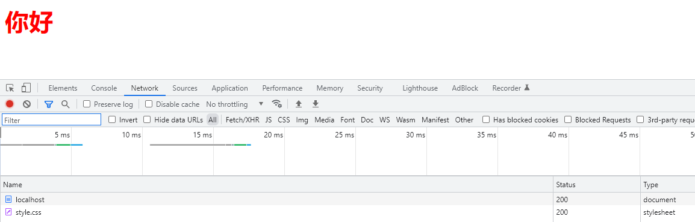

# node.js.server使用说明

## 启动应用
1. 命令行 node server.js 8888
* 命令行显示效果：

* 网页显示效果：

1. 命令行 node server.js 8888 /123(任意字) 
* 命令行显示效果：

* 网页显示效果：

  
## 添加路由
1. 编辑server。js，添加if else语句
2. 重新运行node server.js 8888 /(你设置的参数)

### 使用代码

    console.log("path:" + path);
    
检查bug